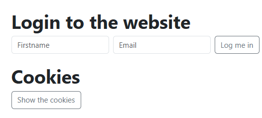
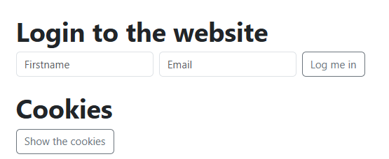
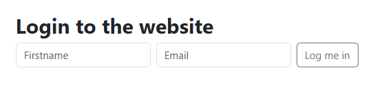
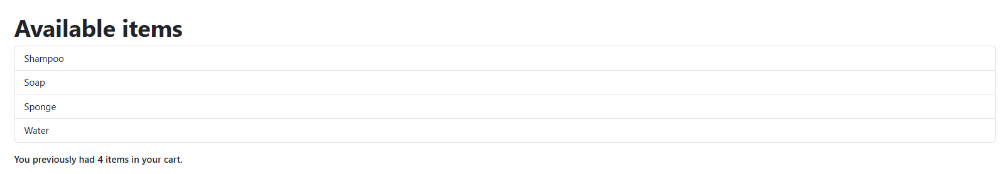
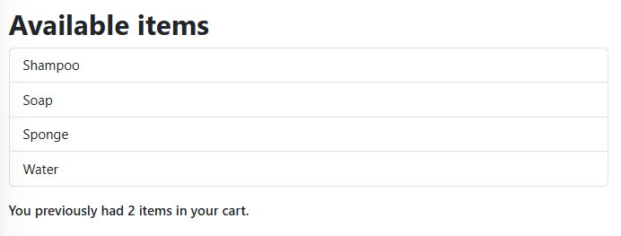
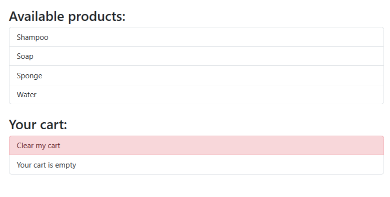
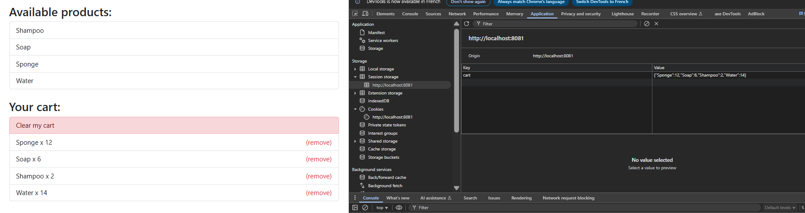

root@UID7E:/mnt/d/Users/steph/Documents/4ème_trimestre_
speFS/holbertonschool-web_front_end/Cookies_local_storage# npx webpack serve
Need to install the following packages:
webpack@5.100.2
Ok to proceed? (y) y

CLI for webpack must be installed.
  webpack-cli (https://github.com/webpack/webpack-cli)

We will use "npm" to install the CLI via "npm install -D webpack-cli".
Do you want to install 'webpack-cli' (yes/no): yes
Installing 'webpack-cli' (running 'npm install -D webpack-cli')...

added 99 packages, and audited 299 packages in 10s

54 packages are looking for funding
  run `npm fund` for details

found 0 vulnerabilities
Error: Cannot find module 'webpack-cli/package.json'
Require stack:
- /root/.npm/_npx/89d6e678e21f2dae/node_modules/webpack/bin/webpack.js
    at Module._resolveFilename (node:internal/modules/cjs/loader:1212:15)
    at Function.resolve (node:internal/modules/helpers:193:19)
    at runCli (/root/.npm/_npx/89d6e678e21f2dae/node_modules/webpack/bin/webpack.js:82:26)
    at /root/.npm/_npx/89d6e678e21f2dae/node_modules/webpack/bin/webpack.js:184:5
    at process.processTicksAndRejections (node:internal/process/task_queues:95:5) {
  code: 'MODULE_NOT_FOUND',
  requireStack: [
    '/root/.npm/_npx/89d6e678e21f2dae/node_modules/webpack/bin/webpack.js'
  ]
}
root@UID7E:/mnt/d/Users/steph/Documents/4ème_trimestre_
speFS/holbertonschool-web_front_end/Cookies_local_storage#

root@UID7E:/mnt/d/Users/steph/Documents/4ème_trimestre_
speFS/holbertonschool-web_front_end/Cookies_local_storage# npx webpack serve
Need to install the following packages:
webpack@5.100.2
Ok to proceed? (y) y

CLI for webpack must be installed.
  webpack-cli (https://github.com/webpack/webpack-cli)

We will use "npm" to install the CLI via "npm install -D webpack-cli".
Do you want to install 'webpack-cli' (yes/no): yes
Installing 'webpack-cli' (running 'npm install -D webpack-cli')...

added 99 packages, and audited 299 packages in 10s

54 packages are looking for funding
  run `npm fund` for details

found 0 vulnerabilities
Error: Cannot find module 'webpack-cli/package.json'
Require stack:
- /root/.npm/_npx/89d6e678e21f2dae/node_modules/webpack/bin/webpack.js
    at /root/.npm/_npx/89d6e678e21f2dae/node_modules/webpack/bin/webpack.js:184:5
    at process.processTicksAndRejections (node:internal    at /root/.npm/_npx/89d6e678e21f2dae/node_modules/webpack/bin/webpack.js:184:5
    at process.processTicksAndRejections (node:internal/process/task_queues:95:5) {
  code: 'MODULE_NOT_FOUND',
  requireStack: [
    '/root/.npm/_npx/89d6e678e21f2dae/node_modules/webpack/bin/webpack.js'
  ]
root@UID7E:/mnt/d/Users/steph/Documents/4ème_trimestre_
speFS/holbertonschool-web_front_end/Cookies_local_storage# rm -rf node_modules package-lock.json
root@UID7E:/mnt/d/Users/steph/Documents/4ème_trimestre_
speFS/holbertonschool-web_front_end/Cookies_local_storage# npm install --save-dev webpack webpack-cli webpack-dev-server

added 297 packages, and audited 298 packages in 20s

54 packages are looking for funding
  run `npm fund` for details

found 0 vulnerabilities
root@UID7E:/mnt/d/Users/steph/Documents/4ème_trimestre_
speFS/holbertonschool-web_front_end/Cookies_local_storage# npm list --depth=0
cookies_local_storage@1.0.0 /mnt/d/Users/steph/Documents/4ème_trimestre_speFS/holbertonschool-web_front_end/Cookies_local_storage
├── webpack-cli@6.0.1
├── webpack-dev-server@5.2.2
└── webpack@5.100.2

root@UID7E:/mnt/d/Users/steph/Documents/4ème_trimestre_
speFS/holbertonschool-web_front_end/Cookies_local_storage#

npx webpack serve

# task0
http://localhost:8081/0-index.html

# task1
http://localhost:8081/1-index.html

# task2
http://localhost:8081/2-index.html

# task3
http://localhost:8081/3-index.html

# task4
http://localhost:8081/4-index.html

# task5
http://localhost:8081/5-index.html

# task6
http://localhost:8081/6-index.html

# task7
http://localhost:8081/7-index.html

