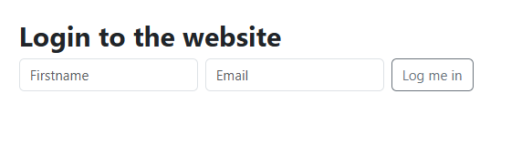

# 🟪 Titre du projet
# 🧩 Cookies & Local Storage
# 📁 Dossier : Cookies_local_storage
# 📚 Projet du repository holbertonschool-web_front_end

# 🎯 Objectifs pédagogiques
Créer, lire et supprimer des cookies en JavaScript

Gérer les options de cookies (expiration, path…)

Utiliser la bibliothèque js-cookie

Différencier localStorage et sessionStorage

Créer une mini application de panier d’achat

# 🛠️ Technologies utilisées
Vanilla JavaScript (ES6)

HTML5

Web Storage API (localStorage, sessionStorage)

js-cookie (via CDN)

Webpack / Node.js v12.x / npm 6.x

# 📂 Structure du projet
Fichier	Fonction
0-index.html	Création de cookies de base
1-index.html	Cookies avec expiration + path
2-index.html	Lecture des cookies
3-index.html	Login + message de bienvenue
4-index.html	Intégration js-cookie
5-index.html	Panier avec localStorage
6-index.html	Panier avec sessionStorage
7-index.html	Panier complet (ajout, suppression, quantité)

# ⚙️ Instructions pour tester
```bash
npm install
npx webpack-dev-server
```
Puis ouvrir dans le navigateur :

http://localhost:8080/0-index.html

...

http://localhost:8080/7-index.html

# 🧪 Vérifications
✅ Manipulation DOM uniquement via JS

✅ Cookies avec expiration (10 jours)

✅ SessionStorage : perte des données après fermeture de l’onglet

✅ Utilisation correcte de JSON.stringify / parse

✅ src/index.js reste vide (Webpack setup)

# 📌 Tâches à valider
Tâche	Description	Statut
0	Créer cookie de base	🔲
1	Ajouter expiration et chemin	🔲
2	Lire les cookies	🔲
3	Message de bienvenue / logout	🔲
4	Utiliser js-cookie (get/set/remove)	🔲
5	Panier localStorage	🔲
6	Panier sessionStorage	🔲
7	Panier avancé avec suppression/clear	🔲


# 🧑‍🏫 Manual Review attendue
Merci de bien vouloir effectuer une relecture manuelle du projet après validation des tâches.
N’hésitez pas à me faire part de vos remarques 🙏

# 👨‍💻 Auteur
👤 Stéphane Dinahet

# 🔗 GitHub Project Link

# 📍 Spécialisation Web Front-End – Holberton School Rennes


root@UID7E:/mnt/d/Users/steph/Documents/4ème_trimestre_
speFS/holbertonschool-web_front_end/Cookies_local_storage# npx webpack serve
Need to install the following packages:
webpack@5.100.2
Ok to proceed? (y) y

CLI for webpack must be installed.
  webpack-cli (https://github.com/webpack/webpack-cli)

We will use "npm" to install the CLI via "npm install -D webpack-cli".
Do you want to install 'webpack-cli' (yes/no): yes
Installing 'webpack-cli' (running 'npm install -D webpack-cli')...

added 99 packages, and audited 299 packages in 10s

54 packages are looking for funding
  run `npm fund` for details

found 0 vulnerabilities
Error: Cannot find module 'webpack-cli/package.json'
Require stack:
- /root/.npm/_npx/89d6e678e21f2dae/node_modules/webpack/bin/webpack.js
    at Module._resolveFilename (node:internal/modules/cjs/loader:1212:15)
    at Function.resolve (node:internal/modules/helpers:193:19)
    at runCli (/root/.npm/_npx/89d6e678e21f2dae/node_modules/webpack/bin/webpack.js:82:26)
    at /root/.npm/_npx/89d6e678e21f2dae/node_modules/webpack/bin/webpack.js:184:5
    at process.processTicksAndRejections (node:internal/process/task_queues:95:5) {
  code: 'MODULE_NOT_FOUND',
  requireStack: [
    '/root/.npm/_npx/89d6e678e21f2dae/node_modules/webpack/bin/webpack.js'
  ]
}
root@UID7E:/mnt/d/Users/steph/Documents/4ème_trimestre_
speFS/holbertonschool-web_front_end/Cookies_local_storage#


root@UID7E:/mnt/d/Users/steph/Documents/4ème_trimestre_
speFS/holbertonschool-web_front_end/Cookies_local_storage# npx webpack serve
Need to install the following packages:
webpack@5.100.2
Ok to proceed? (y) y

CLI for webpack must be installed.
  webpack-cli (https://github.com/webpack/webpack-cli)

We will use "npm" to install the CLI via "npm install -D webpack-cli".
Do you want to install 'webpack-cli' (yes/no): yes
Installing 'webpack-cli' (running 'npm install -D webpack-cli')...

added 99 packages, and audited 299 packages in 10s

54 packages are looking for funding
  run `npm fund` for details

found 0 vulnerabilities
Error: Cannot find module 'webpack-cli/package.json'
Require stack:
- /root/.npm/_npx/89d6e678e21f2dae/node_modules/webpack/bin/webpack.js
    at /root/.npm/_npx/89d6e678e21f2dae/node_modules/webpack/bin/webpack.js:184:5
    at process.processTicksAndRejections (node:internal    at /root/.npm/_npx/89d6e678e21f2dae/node_modules/webpack/bin/webpack.js:184:5
    at process.processTicksAndRejections (node:internal/process/task_queues:95:5) {
  code: 'MODULE_NOT_FOUND',
  requireStack: [
    '/root/.npm/_npx/89d6e678e21f2dae/node_modules/webpack/bin/webpack.js'
  ]
root@UID7E:/mnt/d/Users/steph/Documents/4ème_trimestre_
speFS/holbertonschool-web_front_end/Cookies_local_storage# rm -rf node_modules package-lock.json
root@UID7E:/mnt/d/Users/steph/Documents/4ème_trimestre_
speFS/holbertonschool-web_front_end/Cookies_local_storage# npm install --save-dev webpack webpack-cli webpack-dev-server

added 297 packages, and audited 298 packages in 20s

54 packages are looking for funding
  run `npm fund` for details

found 0 vulnerabilities
root@UID7E:/mnt/d/Users/steph/Documents/4ème_trimestre_
speFS/holbertonschool-web_front_end/Cookies_local_storage# npm list --depth=0
cookies_local_storage@1.0.0 /mnt/d/Users/steph/Documents/4ème_trimestre_speFS/holbertonschool-web_front_end/Cookies_local_storage
├── webpack-cli@6.0.1
├── webpack-dev-server@5.2.2
└── webpack@5.100.2

root@UID7E:/mnt/d/Users/steph/Documents/4ème_trimestre_
speFS/holbertonschool-web_front_end/Cookies_local_storage#


npx webpack serve


# task0
http://localhost:8081/0-index.html


# task1
http://localhost:8081/1-index.html


# task2
http://localhost:8081/2-index.html


# task3
http://localhost:8081/3-index.html


# task4
http://localhost:8081/4-index.html


# task5
http://localhost:8081/5-index.html


# task6
http://localhost:8081/6-index.html


# task7
http://localhost:8081/7-index.html


root@UID7E:/mnt/d/Users/steph/Documents/4ème_trimestre_
speFS/holbertonschool-web_front_end/Cookies_local_storage# npx webpack serve
<i> [webpack-dev-server] Project is running at:
<i> [webpack-dev-server] Loopback: http://localhost:8081/, http://[::1]:8081/
<i> [webpack-dev-server] On Your Network (IPv4): http://172.18.71.179:8081/
<i> [webpack-dev-server] Content not from webpack is served from '/mnt/d/Users/steph/Documents/4ème_trimestre_speFS/holbertonschool-web_front_end/Cookies_local_storage/' directory
<i> [webpack-dev-middleware] wait until bundle finished: /
asset main.js 169 KiB [emitted] (name: main)
runtime modules 27.4 KiB 12 modules
modules by path ./node_modules/ 109 KiB
  modules by path ./node_modules/webpack-dev-server/client/ 84.8 KiB
    modules by path ./node_modules/webpack-dev-server/client/*.js 53.3 KiB 4 modules
    ./node_modules/webpack/hot/log.js 1.73 KiB [built] [code generated]
    ./node_modules/webpack/hot/emitter.js 75 bytes [built] [code generated]
    ./node_modules/webpack/hot/log-apply-result.js 1.43    ./node_modules/webpack/hot/log.js 1.73 KiB [built] [code generated]
    ./node_modules/webpack/hot/emitter.js 75 bytes [built] [code generated]
    ./node_modules/webpack/hot/log-apply-result.js 1.43 KiB [built] [code generated]
  ./node_modules/events/events.js 14.5 KiB [built] [code generated]
  ./node_modules/ansi-html-community/index.js 4.16 KiB [built] [code generated]
./src/index.js 1 bytes [built] [code generated]
webpack 5.100.2 compiled successfully in 15030 ms
