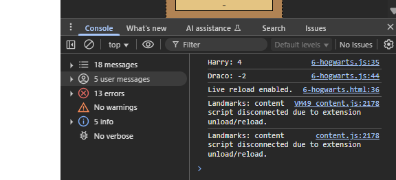
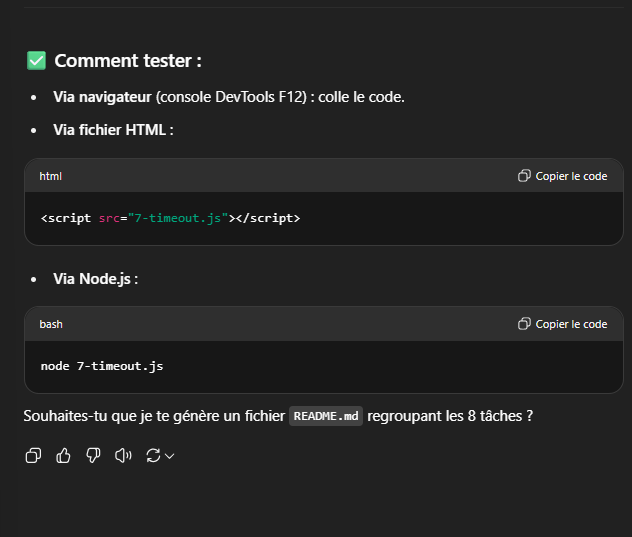
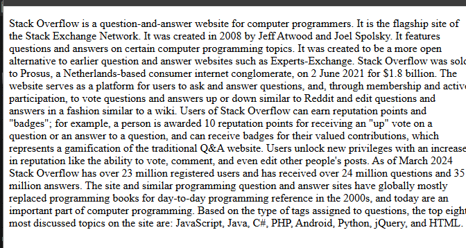
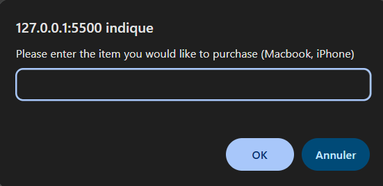
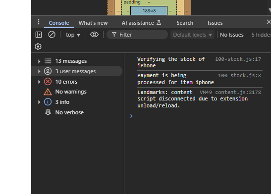
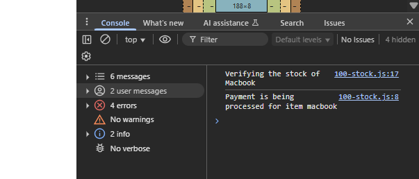
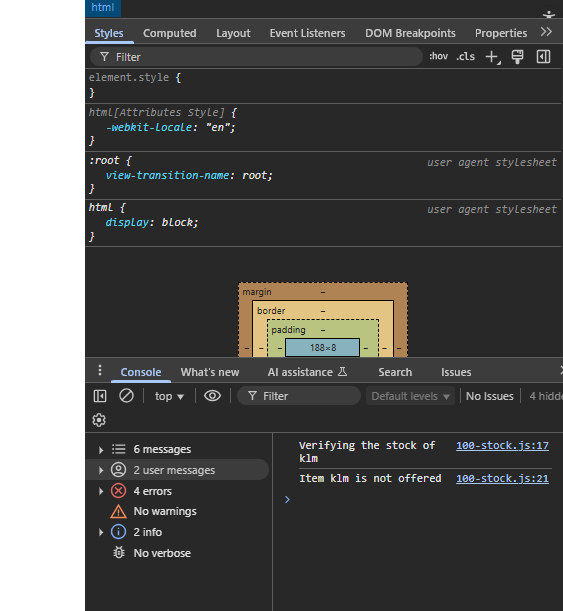

Javascript_advanced

task2
✅ Pour afficher 1 seul dans la console :
javascript

const classRoom = createClassRoom(10);
classRoom[0]();

classRoom[0]()

2142:2837

           GET https://intranet.hbtn.io/assets/javascripts/application/custom/project_tasks.js net::ERR_ABORTED 404 (Not Found)
2142:2865

           GET https://intranet.hbtn.io/assets/javascripts/applications/custom/project.js net::ERR_ABORTED 404 (Not Found)
2142:2960

           GET https://www.google-analytics.com/analytics.js net::ERR_BLOCKED_BY_CLIENT
(anonymous) @ 2142:2960
(anonymous) @ 2142:2961
application-1bc6dd7915d3b62389d2b1e80bd4e9e08c101a17b4117ee518b441b43aa1a5fd.js:4932 [Deprecation] Listener added for a 'DOMNodeInserted' mutation event. Support for this event type has been removed, and this event will no longer be fired. See https://chromestatus.com/feature/5083947249172480 for more information.
add @ application-1bc6dd7915d3b62389d2b1e80bd4e9e08c101a17b4117ee518b441b43aa1a5fd.js:4932
(anonymous) @ application-1bc6dd7915d3b62389d2b1e80bd4e9e08c101a17b4117ee518b441b43aa1a5fd.js:4832
each @ application-1bc6dd7915d3b62389d2b1e80bd4e9e08c101a17b4117ee518b441b43aa1a5fd.js:370
each @ application-1bc6dd7915d3b62389d2b1e80bd4e9e08c101a17b4117ee518b441b43aa1a5fd.js:137
on @ application-1bc6dd7915d3b62389d2b1e80bd4e9e08c101a17b4117ee518b441b43aa1a5fd.js:4831
on @ application-1bc6dd7915d3b62389d2b1e80bd4e9e08c101a17b4117ee518b441b43aa1a5fd.js:5816
readyMoveModal @ application-1bc6dd7915d3b62389d2b1e80bd4e9e08c101a17b4117ee518b441b43aa1a5fd.js:73374
fire @ application-1bc6dd7915d3b62389d2b1e80bd4e9e08c101a17b4117ee518b441b43aa1a5fd.js:3232
fireWith @ application-1bc6dd7915d3b62389d2b1e80bd4e9e08c101a17b4117ee518b441b43aa1a5fd.js:3362
ready @ application-1bc6dd7915d3b62389d2b1e80bd4e9e08c101a17b4117ee518b441b43aa1a5fd.js:3582
completed @ application-1bc6dd7915d3b62389d2b1e80bd4e9e08c101a17b4117ee518b441b43aa1a5fd.js:3617
Unchecked runtime.lastError: The message port closed before a response was received.
Unchecked runtime.lastError: The message port closed before a response was received.
Unchecked runtime.lastError: The message port closed before a response was received.
Unchecked runtime.lastError: The message port closed before a response was received.
Unchecked runtime.lastError: The message port closed before a response was received.
Unchecked runtime.lastError: The message port closed before a response was received.
Unchecked runtime.lastError: The message port closed before a response was received.
Unchecked runtime.lastError: The message port closed before a response was received.
Unchecked runtime.lastError: The message port closed before a response was received.
function createClassRoom(numbersOfStudents) {
  function studentSeat(seat) {
    return function () {
      return seat;
    };
  }

  const students = [];

  for (let i = 0; i < numbersOfStudents; i++) {
    students.push(studentSeat(i + 1));
  }

  return students;
}

const classRoom = createClassRoom(10);

undefined
console.log(classRoom[0]());
console.log(classRoom[3]());
console.log(classRoom[9]());
undefined
function createClassRoom(numbersOfStudents) {
  function studentSeat(seat) {
    return function () {
      return seat;
    };
  }

  const students = [];

  for (let i = 0; i < numbersOfStudents; i++) {
    students.push(studentSeat(i + 1));
  }

  return students;
}

const classRoom = createClassRoom(10);

console.log(classRoom[0]()); // 1
console.log(classRoom[3]()); // 4
console.log(classRoom[9]()); // 10
undefined
all.min.js:5707 WebSocket connection to 'wss://clippy-worker.hbtn.io/socket.io/?page=%2Fprojects%2F2142&user_id=9546&user_infos=%7B%22firstname%22%3A%22St%C3%A9phane%22%2C%22lastname%22%3A%22Dinahet%22%2C%22is_staff%22%3A%22false%22%2C%22slack_id%22%3A%22U0761LZ2DPD%22%2C%22location%22%3A%22Holberton%20Rennes%2C%20France%22%7D&auth_token=%40GRgFfy4G%244ChDcDF7yD!cGEzoYr%3FHgiJ%23tdHhAX&EIO=4&transport=websocket' failed: Invalid frame header
doOpen @ all.min.js:5707
open @ all.min.js:4501
open @ all.min.js:3909
Socket @ all.min.js:3838
./node_modules/engine.io-client/lib/index.js.module.exports @ all.min.js:3682
open @ all.min.js:1638
Manager @ all.min.js:1551
lookup @ all.min.js:1398
initSocket @ socket.js:9
(anonymous) @ app.js:80
2142#task-19788:1 Uncaught (in promise) Error: A listener indicated an asynchronous response by returning true, but the message channel closed before a response was received
2142#task-19788:1 Uncaught (in promise) Error: A listener indicated an asynchronous response by returning true, but the message channel closed before a response was received
2142#task-19788:1 Uncaught (in promise) Error: A listener indicated an asynchronous response by returning true, but the message channel closed before a response was received
2142#task-19788:1 Uncaught (in promise) Error: A listener indicated an asynchronous response by returning true, but the message channel closed before a response was received
2142#task-19788:1 Uncaught (in promise) Error: A listener indicated an asynchronous response by returning true, but the message channel closed before a response was received
2142#task-19788:1 Uncaught (in promise) Error: A listener indicated an asynchronous response by returning true, but the message channel closed before a response was received
all.min.js:5707 WebSocket connection to 'wss://clippy-worker.hbtn.io/socket.io/?page=%2Fprojects%2F2142&user_id=9546&user_infos=%7B%22firstname%22%3A%22St%C3%A9phane%22%2C%22lastname%22%3A%22Dinahet%22%2C%22is_staff%22%3A%22false%22%2C%22slack_id%22%3A%22U0761LZ2DPD%22%2C%22location%22%3A%22Holberton%20Rennes%2C%20France%22%7D&auth_token=%40GRgFfy4G%244ChDcDF7yD!cGEzoYr%3FHgiJ%23tdHhAX&EIO=4&transport=websocket' failed: Invalid frame header
doOpen @ all.min.js:5707
open @ all.min.js:4501
open @ all.min.js:3909
Socket @ all.min.js:3838
./node_modules/engine.io-client/lib/index.js.module.exports @ all.min.js:3682
open @ all.min.js:1638
connect @ all.min.js:2138
resetInactivityTimer @ activity.js:11
all.min.js:5707 WebSocket connection to 'wss://clippy-worker.hbtn.io/socket.io/?page=%2Fprojects%2F2142&user_id=9546&user_infos=%7B%22firstname%22%3A%22St%C3%A9phane%22%2C%22lastname%22%3A%22Dinahet%22%2C%22is_staff%22%3A%22false%22%2C%22slack_id%22%3A%22U0761LZ2DPD%22%2C%22location%22%3A%22Holberton%20Rennes%2C%20France%22%7D&auth_token=%40GRgFfy4G%244ChDcDF7yD!cGEzoYr%3FHgiJ%23tdHhAX&EIO=4&transport=websocket' failed: Invalid frame header
doOpen @ all.min.js:5707
open @ all.min.js:4501
open @ all.min.js:3909
Socket @ all.min.js:3838
./node_modules/engine.io-client/lib/index.js.module.exports @ all.min.js:3682
open @ all.min.js:1638
connect @ all.min.js:2138
resetInactivityTimer @ activity.js:11
all.min.js:5707 WebSocket connection to 'wss://clippy-worker.hbtn.io/socket.io/?page=%2Fprojects%2F2142&user_id=9546&user_infos=%7B%22firstname%22%3A%22St%C3%A9phane%22%2C%22lastname%22%3A%22Dinahet%22%2C%22is_staff%22%3A%22false%22%2C%22slack_id%22%3A%22U0761LZ2DPD%22%2C%22location%22%3A%22Holberton%20Rennes%2C%20France%22%7D&auth_token=%40GRgFfy4G%244ChDcDF7yD!cGEzoYr%3FHgiJ%23tdHhAX&EIO=4&transport=websocket' failed: Invalid frame header
doOpen @ all.min.js:5707
open @ all.min.js:4501
open @ all.min.js:3909
Socket @ all.min.js:3838
./node_modules/engine.io-client/lib/index.js.module.exports @ all.min.js:3682
open @ all.min.js:1638
connect @ all.min.js:2138
resetInactivityTimer @ activity.js:11
all.min.js:5707 WebSocket connection to 'wss://clippy-worker.hbtn.io/socket.io/?page=%2Fprojects%2F2142&user_id=9546&user_infos=%7B%22firstname%22%3A%22St%C3%A9phane%22%2C%22lastname%22%3A%22Dinahet%22%2C%22is_staff%22%3A%22false%22%2C%22slack_id%22%3A%22U0761LZ2DPD%22%2C%22location%22%3A%22Holberton%20Rennes%2C%20France%22%7D&auth_token=%40GRgFfy4G%244ChDcDF7yD!cGEzoYr%3FHgiJ%23tdHhAX&EIO=4&transport=websocket' failed: Invalid frame header
doOpen @ all.min.js:5707
open @ all.min.js:4501
open @ all.min.js:3909
Socket @ all.min.js:3838
./node_modules/engine.io-client/lib/index.js.module.exports @ all.min.js:3682
open @ all.min.js:1638
connect @ all.min.js:2138
resetInactivityTimer @ activity.js:11
all.min.js:5707 WebSocket connection to 'wss://clippy-worker.hbtn.io/socket.io/?page=%2Fprojects%2F2142&user_id=9546&user_infos=%7B%22firstname%22%3A%22St%C3%A9phane%22%2C%22lastname%22%3A%22Dinahet%22%2C%22is_staff%22%3A%22false%22%2C%22slack_id%22%3A%22U0761LZ2DPD%22%2C%22location%22%3A%22Holberton%20Rennes%2C%20France%22%7D&auth_token=%40GRgFfy4G%244ChDcDF7yD!cGEzoYr%3FHgiJ%23tdHhAX&EIO=4&transport=websocket' failed: Invalid frame header
doOpen @ all.min.js:5707
open @ all.min.js:4501
open @ all.min.js:3909
Socket @ all.min.js:3838
./node_modules/engine.io-client/lib/index.js.module.exports @ all.min.js:3682
open @ all.min.js:1638
connect @ all.min.js:2138
resetInactivityTimer @ activity.js:11
all.min.js:5707 WebSocket connection to 'wss://clippy-worker.hbtn.io/socket.io/?page=%2Fprojects%2F2142&user_id=9546&user_infos=%7B%22firstname%22%3A%22St%C3%A9phane%22%2C%22lastname%22%3A%22Dinahet%22%2C%22is_staff%22%3A%22false%22%2C%22slack_id%22%3A%22U0761LZ2DPD%22%2C%22location%22%3A%22Holberton%20Rennes%2C%20France%22%7D&auth_token=%40GRgFfy4G%244ChDcDF7yD!cGEzoYr%3FHgiJ%23tdHhAX&EIO=4&transport=websocket' failed: Invalid frame header
doOpen @ all.min.js:5707
open @ all.min.js:4501
open @ all.min.js:3909
Socket @ all.min.js:3838
./node_modules/engine.io-client/lib/index.js.module.exports @ all.min.js:3682
open @ all.min.js:1638
connect @ all.min.js:2138
resetInactivityTimer @ activity.js:11
all.min.js:5707 WebSocket connection to 'wss://clippy-worker.hbtn.io/socket.io/?page=%2Fprojects%2F2142&user_id=9546&user_infos=%7B%22firstname%22%3A%22St%C3%A9phane%22%2C%22lastname%22%3A%22Dinahet%22%2C%22is_staff%22%3A%22false%22%2C%22slack_id%22%3A%22U0761LZ2DPD%22%2C%22location%22%3A%22Holberton%20Rennes%2C%20France%22%7D&auth_token=%40GRgFfy4G%244ChDcDF7yD!cGEzoYr%3FHgiJ%23tdHhAX&EIO=4&transport=websocket' failed: Invalid frame header
doOpen @ all.min.js:5707
open @ all.min.js:4501
open @ all.min.js:3909
Socket @ all.min.js:3838
./node_modules/engine.io-client/lib/index.js.module.exports @ all.min.js:3682
open @ all.min.js:1638
connect @ all.min.js:2138
resetInactivityTimer @ activity.js:11
all.min.js:5707 WebSocket connection to 'wss://clippy-worker.hbtn.io/socket.io/?page=%2Fprojects%2F2142&user_id=9546&user_infos=%7B%22firstname%22%3A%22St%C3%A9phane%22%2C%22lastname%22%3A%22Dinahet%22%2C%22is_staff%22%3A%22false%22%2C%22slack_id%22%3A%22U0761LZ2DPD%22%2C%22location%22%3A%22Holberton%20Rennes%2C%20France%22%7D&auth_token=%40GRgFfy4G%244ChDcDF7yD!cGEzoYr%3FHgiJ%23tdHhAX&EIO=4&transport=websocket' failed: Invalid frame header
doOpen @ all.min.js:5707
open @ all.min.js:4501
open @ all.min.js:3909
Socket @ all.min.js:3838
./node_modules/engine.io-client/lib/index.js.module.exports @ all.min.js:3682
open @ all.min.js:1638
connect @ all.min.js:2138
resetInactivityTimer @ activity.js:11
all.min.js:5707 WebSocket connection to 'wss://clippy-worker.hbtn.io/socket.io/?page=%2Fprojects%2F2142&user_id=9546&user_infos=%7B%22firstname%22%3A%22St%C3%A9phane%22%2C%22lastname%22%3A%22Dinahet%22%2C%22is_staff%22%3A%22false%22%2C%22slack_id%22%3A%22U0761LZ2DPD%22%2C%22location%22%3A%22Holberton%20Rennes%2C%20France%22%7D&auth_token=%40GRgFfy4G%244ChDcDF7yD!cGEzoYr%3FHgiJ%23tdHhAX&EIO=4&transport=websocket' failed: Invalid frame header
doOpen @ all.min.js:5707
open @ all.min.js:4501
open @ all.min.js:3909
Socket @ all.min.js:3838
./node_modules/engine.io-client/lib/index.js.module.exports @ all.min.js:3682
open @ all.min.js:1638
connect @ all.min.js:2138
resetInactivityTimer @ activity.js:11
function createClassRoom(numbersOfStudents) {
  function studentSeat(seat) {
    return function () {
      return seat;
    };
  }

  const students = [];

  for (let i = 0; i < numbersOfStudents; i++) {
    students.push(studentSeat(i + 1));
  }

  return students;
}

const classRoom = createClassRoom(10);

console.log(classRoom[0]()); // 1
console.log(classRoom[3]()); // 4
console.log(classRoom[9]()); // 10
undefined
all.min.js:5707 WebSocket connection to 'wss://clippy-worker.hbtn.io/socket.io/?page=%2Fprojects%2F2142&user_id=9546&user_infos=%7B%22firstname%22%3A%22St%C3%A9phane%22%2C%22lastname%22%3A%22Dinahet%22%2C%22is_staff%22%3A%22false%22%2C%22slack_id%22%3A%22U0761LZ2DPD%22%2C%22location%22%3A%22Holberton%20Rennes%2C%20France%22%7D&auth_token=%40GRgFfy4G%244ChDcDF7yD!cGEzoYr%3FHgiJ%23tdHhAX&EIO=4&transport=websocket' failed: Invalid frame header
doOpen @ all.min.js:5707
open @ all.min.js:4501
open @ all.min.js:3909
Socket @ all.min.js:3838
./node_modules/engine.io-client/lib/index.js.module.exports @ all.min.js:3682
open @ all.min.js:1638
connect @ all.min.js:2138
resetInactivityTimer @ activity.js:11
function createClassRoom(numbersOfStudents) {
  function studentSeat(seat) {
    return function () {
      return seat;
    };
  }

  const students = [];

  for (let i = 0; i < numbersOfStudents; i++) {
    students.push(studentSeat(i + 1));
  }

  return students;
}

const classRoom = createClassRoom(10);

console.log(classRoom[0]());
undefined
function createClassRoom(numbersOfStudents) {
  function studentSeat(seat) {
    return function () {
      return seat;
    };
  }

  const students = [];

  for (let i = 0; i < numbersOfStudents; i++) {
    students.push(studentSeat(i + 1));
  }

  return students;
}

const classRoom = createClassRoom(10);
undefined

console.log(classRoom[0]()); // 1
undefined
all.min.js:5707 WebSocket connection to 'wss://clippy-worker.hbtn.io/socket.io/?page=%2Fprojects%2F2142&user_id=9546&user_infos=%7B%22firstname%22%3A%22St%C3%A9phane%22%2C%22lastname%22%3A%22Dinahet%22%2C%22is_staff%22%3A%22false%22%2C%22slack_id%22%3A%22U0761LZ2DPD%22%2C%22location%22%3A%22Holberton%20Rennes%2C%20France%22%7D&auth_token=%40GRgFfy4G%244ChDcDF7yD!cGEzoYr%3FHgiJ%23tdHhAX&EIO=4&transport=websocket' failed: Invalid frame header
doOpen @ all.min.js:5707
open @ all.min.js:4501
open @ all.min.js:3909
Socket @ all.min.js:3838
./node_modules/engine.io-client/lib/index.js.module.exports @ all.min.js:3682
open @ all.min.js:1638
connect @ all.min.js:2138
resetInactivityTimer @ activity.js:11
all.min.js:5707 WebSocket connection to 'wss://clippy-worker.hbtn.io/socket.io/?page=%2Fprojects%2F2142&user_id=9546&user_infos=%7B%22firstname%22%3A%22St%C3%A9phane%22%2C%22lastname%22%3A%22Dinahet%22%2C%22is_staff%22%3A%22false%22%2C%22slack_id%22%3A%22U0761LZ2DPD%22%2C%22location%22%3A%22Holberton%20Rennes%2C%20France%22%7D&auth_token=%40GRgFfy4G%244ChDcDF7yD!cGEzoYr%3FHgiJ%23tdHhAX&EIO=4&transport=websocket' failed: Invalid frame header
doOpen @ all.min.js:5707
open @ all.min.js:4501
open @ all.min.js:3909
Socket @ all.min.js:3838
./node_modules/engine.io-client/lib/index.js.module.exports @ all.min.js:3682
open @ all.min.js:1638
connect @ all.min.js:2138
resetInactivityTimer @ activity.js:11
const classRoom = createClassRoom(10);
classRoom[0]();

1
classRoom[0]()

1
function divideBy(firstNumber) {
  return function (secondNumber) {
    return secondNumber / firstNumber;
  };
}

function addBy(firstNumber) {
  return function (secondNumber) {
    return secondNumber + firstNumber;
  };
}

// Création des closures
const addBy100 = addBy(100);
const addBy1000 = addBy(1000);
const divideBy10 = divideBy(10);
const divideBy100 = divideBy(100);

// Tests demandés
console.log(addBy100(20));     // 120
console.log(divideBy10(20));   // 2
console.log(divideBy100(200)); // 2
console.log(addBy1000(20));    // 1020

undefined
console.log(addBy100(20));
undefined
function divideBy(firstNumber) {
  return function (secondNumber) {
    return secondNumber / firstNumber;
  };
}

function addBy(firstNumber) {
  return function (secondNumber) {
    return secondNumber + firstNumber;
  };
}

// Création des closures
const addBy100 = addBy(100);
const addBy1000 = addBy(1000);
const divideBy10 = divideBy(10);
const divideBy100 = divideBy(100);

undefined
addBy100(20)
120
divideBy10(20)
2
divideBy100(200)
2
addBy1000(20)
1020

task4

task7

task8

node 8-payments.js

root@UID7E:/mnt/d/Users/steph/Documents/4ème_trimestre_sp
eFS/holbertonschool-web_front_end/Javascript_advanced# node 8-payments.js
Processing orders
12321 is being processed
Collecting payment of 10.99
12321 has been fully processed
12322 is being processed
Collecting payment of 12.99
12322 has been fully processed
12323 is being processed
Collecting payment of 15
12323 has been fully processed

root@UID7E:/mnt/d/Users/steph/Documents/4ème_trimestre_sp
eFS/holbertonschool-web_front_end/Javascript_advanced# no
de 9-prime.js
Execution time of printing countPrimeNumbers was 0.10770500000000993 milliseconds.

root@UID7E:/mnt/d/Users/steph/Documents/4ème_trimestre_sp
eFS/holbertonschool-web_front_end/Javascript_advanced# no
de 10-prime.js
Execution time of calculating prime numbers 100 times was 11.254985999999995 milliseconds.

root@UID7E:/mnt/d/Users/steph/Documents/4ème_trimestre_sp
eFS/holbertonschool-web_front_end/Javascript_advanced# no
de 11-prime.js
Start of script
End of script
Execution time of calculating prime numbers 100 times was 2.6917430000000024 milliseconds.

root@UID7E:/mnt/d/Users/steph/Documents/4ème_trimestre_sp
eFS/holbertonschool-web_front_end/Javascript_advanced# no
de 12-room_area.js
5000

root@UID7E:/mnt/d/Users/steph/Documents/4ème_trimestre_sp
eFS/holbertonschool-web_front_end/Javascript_advanced# no
de 13-bind_user.js
Welcome, Guillaume. Your occupation is: Engineer

root@UID7E:/mnt/d/Users/steph/Documents/4ème_trimestre_sp
eFS/holbertonschool-web_front_end/Javascript_advanced# no
de 14-wikipedia.js
/mnt/d/Users/steph/Documents/4ème_trimestre_speFS/holbertonschool-web_front_end/Javascript_advanced/14-wikipedia.js:10
  const xhr = new XMLHttpRequest();
              ^

ReferenceError: XMLHttpRequest is not defined
    at queryWikipedia (/mnt/d/Users/steph/Documents/4ème_trimestre_speFS/holbertonschool-web_front_end/Javascript_advanced/14-wikipedia.js:10:15)
    at Object.<anonymous> (/mnt/d/Users/steph/Documents/4ème_trimestre_speFS/holbertonschool-web_front_end/Javascript_advanced/14-wikipedia.js:31:1)
    at Module._compile (node:internal/modules/cjs/loader:1529:14)
    at Module._extensions..js (node:internal/modules/cjs/loader:1613:10)
    at Module.load (node:internal/modules/cjs/loader:1275:32)
    at Module._load (node:internal/modules/cjs/loader:1096:12)
    at Function.executeUserEntryPoint [as runMain] (node:internal/modules/run_main:164:12)
    at node:internal/main/run_main_module:28:49

Node.js v20.19.0
root@UID7E:/mnt/d/Users/steph/Documents/4ème_trimestre_sp
eFS/holbertonschool-web_front_end/Javascript_advanced#

root@UID7E:/mnt/d/Users/steph/Documents/4ème_trimestre_sp
eFS/holbertonschool-web_front_end/Javascript_advanced# no
de 100-stock.js
/mnt/d/Users/steph/Documents/4ème_trimestre_speFS/holbertonschool-web_front_end/Javascript_advanced/100-stock.js:33
const userInput = prompt("Please enter the item you would like to purchase (Macbook, iPhone)");
                  ^

ReferenceError: prompt is not defined
    at Object.<anonymous> (/mnt/d/Users/steph/Documents/4ème_trimestre_speFS/holbertonschool-web_front_end/Javascript_advanced/100-stock.js:33:19)
    at Module._compile (node:internal/modules/cjs/loader:1529:14)
    at Module._extensions..js (node:internal/modules/cjs/loader:1613:10)
    at Module.load (node:internal/modules/cjs/loader:1275:32)
    at Module._load (node:internal/modules/cjs/loader:1096:12)
    at Function.executeUserEntryPoint [as runMain] (node:internal/modules/run_main:164:12)
    at node:internal/main/run_main_module:28:49

Node.js v20.19.0
root@UID7E:/mnt/d/Users/steph/Documents/4ème_trimestre_sp
eFS/holbertonschool-web_front_end/Javascript_advanced#

